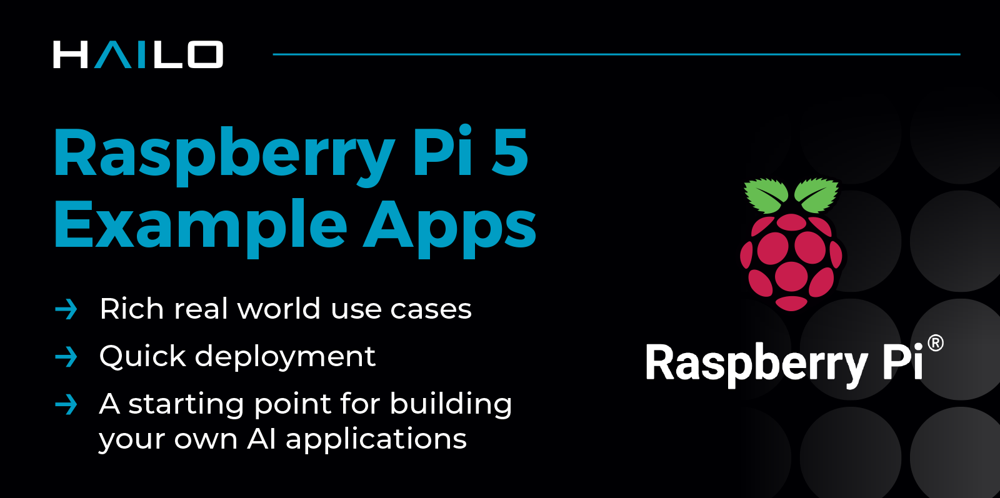
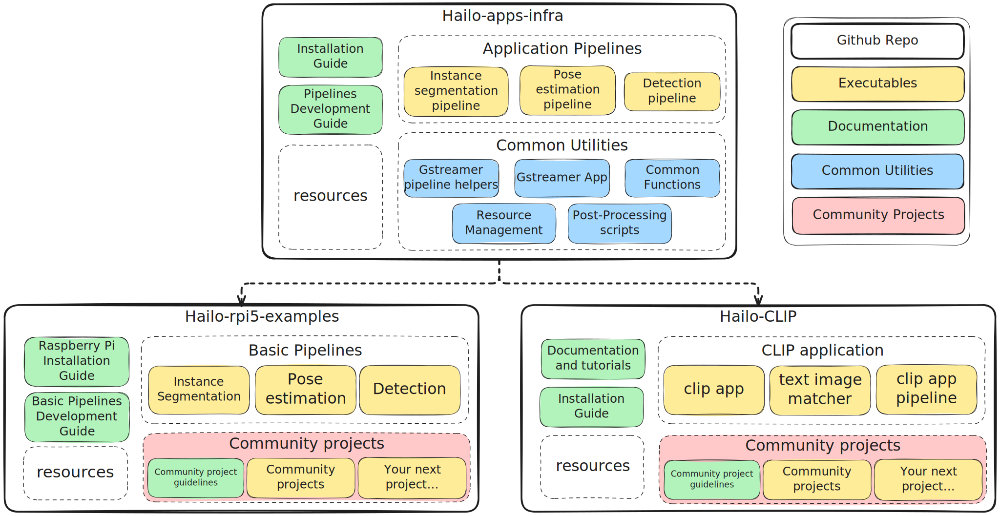

# Hailo Raspberry Pi 5 Examples

Welcome to the Hailo Raspberry Pi 5 Examples repository. This project showcases various examples demonstrating the capabilities of the Hailo AI processor on a Raspberry Pi 5. These examples will help you get started with AI on embedded devices.
The examples in this repository are designed to work with the Raspberry Pi AI Kit and AI HAT, supporting both the Hailo8 (26 TOPS) and Hailo8L (13 TOPS) AI processors. The examples can also be run on an x86_64 Ubuntu machine with the Hailo8/8L AI processor.
Visit the [Hailo Official Website](https://hailo.ai/) and [Hailo Community Forum](https://community.hailo.ai/) for more information.

## Install Hailo Hardware and Software Setup on Raspberry Pi

For instructions on how to set up Hailo's hardware and software on the Raspberry Pi 5, see the [Hailo Raspberry Pi 5 installation guide](doc/install-raspberry-pi5.md#how-to-set-up-raspberry-pi-5-and-hailo).


# Hailo RPi5 Basic Pipelines
The basic pipelines examples demonstrate object detection, human pose estimation, and instance segmentation, providing a solid foundation for your own projects.
This repo is using our new [Hailo Apps Infra](https://github.com/hailo-ai/hailo-apps-infra) repo as a dependency.
See our Developement Guide for more information on how to use the pipelines to create your own custom pipelines.

## Installation

### Clone the Repository
```bash
git clone https://github.com/hailo-ai/hailo-rpi5-examples.git
```
Navigate to the repository directory:
```bash
cd hailo-rpi5-examples
```

### Installation
Run the following script to automate the installation process:
```bash
./install.sh
```

### Documentation
For additional information and documentation see the [Basic Pipelines Documentation](doc/basic-pipelines.md#installation).

See our [Developement Guide](doc/basic-pipelines.md#development-guide) for more information on how to use the pipelines to create your own custom pipelines.

### Running The Examples
When opening a new terminal session, ensure you have sourced the environment setup script:
```bash
source setup_env.sh
```
### Detection Example
For more information see [Detection Example Documentation.](doc/basic-pipelines.md#detection-example)


#### Run the detection example:
```bash
python basic_pipelines/detection.py
```
To close the application, press `Ctrl+C`.

#### Running with Raspberry Pi Camera input:
```bash
python basic_pipelines/detection.py --input rpi
```

#### Running with USB camera input (webcam):
Detect the available camera using this script:
```bash
get-usb-camera
```
Run example using USB camera input - Use the device found by the previous script:
```bash
python basic_pipelines/detection.py --input /dev/video<X>
```

For additional options, execute:
```bash
python basic_pipelines/detection.py --help
```

#### Retrained Networks Support
This application includes support for using retrained detection models. For more information, see [Using Retrained Models](doc/basic-pipelines.md#using-retrained-models).

### Pose Estimation Example
For more information see [Pose Estimation Example Documentation.](doc/basic-pipelines.md#pose-estimation-example)


#### Run the pose estimation example:
```bash
python basic_pipelines/pose_estimation.py
```
To close the application, press `Ctrl+C`.
See Detection Example above for additional input options examples.

### Instance Segmentation Example
For more information see [Instance Segmentation Example Documentation.](doc/basic-pipelines.md#instance-segmentation-example)


#### Run the instance segmentation example:
```bash
python basic_pipelines/instance_segmentation.py
```
To close the application, press `Ctrl+C`.
See Detection Example above for additional input options examples.

### Community Projects

Get involved and make your mark! Explore our Community Projects and start contributing today, because together, we build better things! 🚀
Check out our [Community Projects](community_projects/community_projects.md) for more information.

# Additional Examples and Resources



## Hailo Apps Infra
Hailo RPi5 Examples are using the [Hailo Apps Infra Repository](https://github.com/hailo-ai/hailo-apps-infra) as a dependency. The Hailo Apps Infra repository contains the infrastructure of Hailo applications and pipelines.
It is aimed for to provide tools for developers who want to create their own custom pipelines and applications. It features a simple and easy-to-use API for creating custom pipelines and applications.
It it installed as a pip package and can be used as a dependency in your own projects. See more information in its documentation and Development Guide.

### CLIP Application

CLIP (Contrastive Language-Image Pre-training) predicts the most relevant text prompt on real-time video frames using Hailo8/8l AI processor.
See the [hailo-CLIP Repository](https://github.com/hailo-ai/hailo-CLIP) for more information.
Click the image below to watch the demo on YouTube.

[](https://youtu.be/XXizBHtCLew)


#### Frigate Integration - Coming Soon

Frigate is an open-source video surveillance software that runs on a Raspberry Pi. This integration will allow you to use the Hailo-8L AI processor for object detection in real-time video streams.


### Raspberry Pi Official Examples

#### rpicam-apps

Raspberry Pi [rpicam-apps](https://www.raspberrypi.com/documentation/computers/camera_software.html#rpicam-apps) Hailo post-processing examples.
This is Raspberry Pi's official example for AI post-processing using the Hailo AI processor integrated into their CPP camera framework.
The documentation on how to use rpicam-apps can be found [here](https://www.raspberrypi.com/documentation/computers/ai.html).

#### picamera2

Raspberry Pi [picamera2](https://github.com/raspberrypi/picamera2) is the libcamera-based replacement for Picamera, which was a Python interface to the Raspberry Pi's legacy camera stack. Picamera2 also presents an easy-to-use Python API.

## Additional Resources

### Hailo Python API
The Hailo Python API is now available on the Raspberry Pi 5. This API allows you to run inference on the Hailo-8L AI processor using Python.
For examples, see our [Python code examples](https://github.com/hailo-ai/Hailo-Application-Code-Examples/tree/main/runtime/python).
Additional examples can be found in RPi [picamera2](#picamera2) code.
Visit our [HailoRT Python API documentation](https://hailo.ai/developer-zone/documentation/hailort-v4-18-0/?page=api%2Fpython_api.html#module-hailo_platform.drivers) for more information.

### Hailo Dataflow Compiler (DFC)

The Hailo Dataflow Compiler (DFC) is a software tool that enables developers to compile their neural networks to run on the Hailo-8/8L AI processors.
The DFC is available for download from the [Hailo Developer Zone](https://hailo.ai/developer-zone/software-downloads/) (Registration required).
For examples, tutorials, and retrain instructions, see the [Hailo Model Zoo Repo](https://github.com/hailo-ai/hailo_model_zoo).
Additional documentation and [tutorials](https://hailo.ai/developer-zone/documentation/dataflow-compiler/latest/?sp_referrer=tutorials/tutorials.html) can be found in the [Hailo Developer Zone Documentation](https://hailo.ai/developer-zone/documentation/).
For a full end-to-end training and deployment example, see the [Retraining Example](doc/retraining-example.md).
The detection basic pipeline example includes support for retrained models. For more information, see [Using Retrained Models](doc/basic-pipelines.md#using-retrained-models).

## Contributing

We welcome contributions from the community. You can contribute by:
1. Contribute to our [Community Projects](community_projects/community_projects.md).
2. Reporting issues and bugs.
3. Suggesting new features or improvements.
4. Joining the discussion on the [Hailo Community Forum](https://community.hailo.ai/).


## License

This project is licensed under the MIT License. See the [LICENSE](LICENSE) file for details.

## Disclaimer

This code example is provided by Hailo solely on an “AS IS” basis and “with all faults.” No responsibility or liability is accepted or shall be imposed upon Hailo regarding the accuracy, merchantability, completeness, or suitability of the code example. Hailo shall not have any liability or responsibility for errors or omissions in, or any business decisions made by you in reliance on this code example or any part of it. If an error occurs when running this example, please open a ticket in the "Issues" tab.
